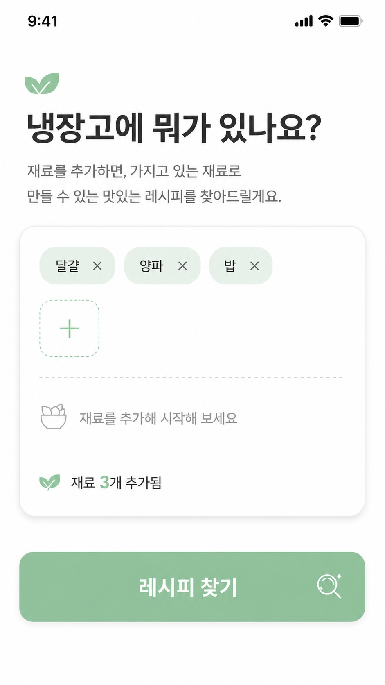
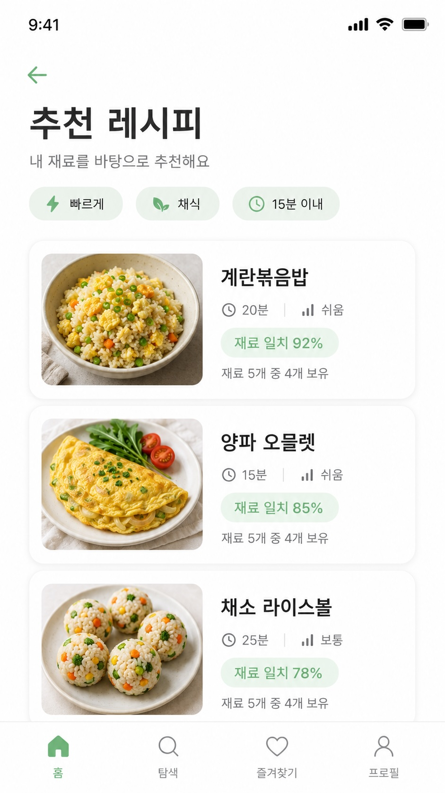
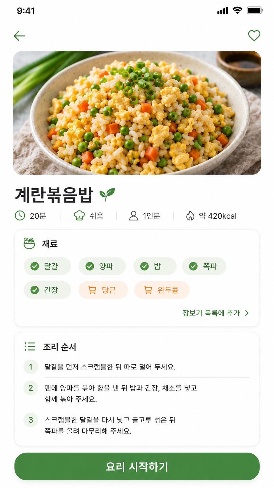

# Codyssey Term Project A

## 최종평가 확인용 요약

- 최종 제출 대상: **냉장고 파먹기 / fridge-chef**
- 서비스 한 줄 설명: 냉장고 속 재료를 기반으로 레시피를 추천하고, 부족 재료를 장보기 행동으로 연결하는 모바일 UI/UX 시안
- Figma 프로토타입: [코디세이-냉장고파먹기 프로토타입 보기](http://figma.com/proto/LJFKOHqUG00vgMj6fH9IuI/코디세이-냉장고파먹기-UI-UX?node-id=0-1&p=f&t=rsnmc3vy4TyHLBKn-0&scaling=scale-down&content-scaling=fixed&page-id=0%3A1)
- 작업 로그: [docs/fridge-chef-work-log.md](docs/fridge-chef-work-log.md)
- 평가 대응표: [docs/evaluation-index.md](docs/evaluation-index.md)
- 종합 작업 로그: [docs/work-log.md](docs/work-log.md)
- 프롬프트 로그: [docs/prompt-log.md](docs/prompt-log.md)
- 디자인 의사결정 기록: [docs/design-decision-log.md](docs/design-decision-log.md)
- 참고/보조 시안: EcoTrack은 최종 제출물이 아니라 참고/보조 시안으로만 관리합니다.

### 최종 UI 이미지

#### 1. 메인 화면

#### 2. 목록 화면

#### 3. 상세 화면

## 사전평가 본문 증빙

이번 보강은 AI 사전평가가 하위 문서 링크를 충분히 따라가지 못할 수 있다는 전제에서 README 본문만 읽어도 평가 항목별 근거를 확인할 수 있게 하기 위한 것입니다. 아래 내용은 repo 내부 문서, 최종 UI 이미지 경로, Issue #9 코멘트에 남은 작업자/검수자 기록을 근거로 정리했습니다. 실제로 확인되지 않은 시드값 사용이나 실제로 없던 텍스트 깨짐 수정 과정은 만들지 않았습니다.

### 1. 텍스트 깨짐과 가독성 검수

영어/한국어 최종 이미지 모두에서 텍스트 깨짐은 관찰되지 않은 것으로 기록되어 있습니다. Issue #9 작업자 코멘트에는 한글로도 생성했고 GPT IMAGE 2 성능이 좋아 깨짐이 없다는 취지가 남아 있으며, 검수 코멘트에도 영어/한글 모두 텍스트 깨짐이 없고 화면 구성, 배치, 폰트, 아이콘, 색상 선택과 조화가 좋았다는 취지가 기록되어 있습니다.

따라서 사후 텍스트 교정은 수행하지 않았고, 이 항목은 **문제 없음 검수**로 처리했습니다. 평가 기준을 맞추기 위해 실제로 없던 텍스트 깨짐을 만들어내지 않았습니다.

| 검수 항목 | 판단 | 근거 |
| --- | --- | --- |
| 영어 텍스트 | 문제 없음 | 초안 이미지 검수 결과 깨짐 없음 |
| 한국어 텍스트 | 문제 없음 | 한국어 버전 재생성 후 깨짐 없음으로 기록 |
| 사후 텍스트 교정 | 해당 없음 | 수정할 텍스트 깨짐이 관찰되지 않음 |
| 평가 대응 | 문제 없음 검수 | 실제 결과를 있는 그대로 기록 |

### 2. Figma 화면 배치와 Hotspot 흐름

최종 UI 이미지 3장은 Figma에 통째로 배치했고, 투명 Hotspot으로 메인 화면에서 목록 화면, 목록 화면에서 상세 화면으로 넘어가는 흐름을 구성했습니다. Issue #9에는 Figma로 이미지를 통째로 옮겼고 클릭으로 화면인 홈-목록-상세 넘어가는 UX를 표현했다는 취지가 기록되어 있습니다.

- Figma 프로토타입: [코디세이-냉장고파먹기 프로토타입 보기](http://figma.com/proto/LJFKOHqUG00vgMj6fH9IuI/코디세이-냉장고파먹기-UI-UX?node-id=0-1&p=f&t=rsnmc3vy4TyHLBKn-0&scaling=scale-down&content-scaling=fixed&page-id=0%3A1)
- 화면 흐름: `메인 화면 → 목록 화면 → 상세 화면`
- Hotspot 방식: 이미지 위 투명 클릭 영역으로 다음 화면 이동
- 선택 이유: 정적인 이미지 3장을 실제 앱 사용 흐름으로 평가할 수 있게 하기 위함

### 3. 사용자 목표와 핵심 플로우 3단계

사용자 목표는 자취생이 이미 가진 재료로 만들 수 있는 요리를 빠르게 찾고, 부족 재료가 있으면 장보기 행동으로 이어지게 하는 것입니다.

| 단계 | 화면 | 사용자 행동 | 설계 이유 |
| --- | --- | --- | --- |
| 1 | 메인 화면 | 보유 재료 입력 | 서비스의 출발점이 냉장고 속 재료이므로 첫 행동을 재료 입력으로 고정 |
| 2 | 목록 화면 | 추천 레시피 비교 | 여러 레시피를 조리 시간, 난이도, 재료 일치율 기준으로 비교 |
| 3 | 상세 화면 | 조리 단계와 부족 재료 확인 | 실제 조리와 장보기 행동으로 이어지게 함 |

### 4. 화면 3종의 정보 구조와 동선

| 화면 | 우선 배치 정보 | 동선 기준 |
| --- | --- | --- |
| 메인 | 인사말, 재료 입력 칩, 추가 버튼, Find Recipes CTA | 재료 입력을 가장 먼저 수행하도록 유도 |
| 목록 | 추천 레시피 카드, 조리 시간, 난이도, 재료 일치율 | 비교 판단에 필요한 정보를 카드 안에 압축 |
| 상세 | 완성 이미지, 재료/부족 재료, 조리 단계, Start Cooking CTA | 기대 결과 확인 후 재료 확인, 조리 실행으로 이동 |

### 5. 프롬프트 단계적 수정 과정

| 화면 | 초안 문제 | 수정한 요소 | 변경 이유 | 결과 영향 |
| --- | --- | --- | --- | --- |
| 메인 | 검색바와 재료 입력 역할 중복 | 검색바 제거, 재료 칩, 추가 버튼, 재료 카운터 | 핵심 행동을 재료 입력으로 명확화 | 첫 화면의 목적이 선명해짐 |
| 목록 | 카드 수와 추천 근거가 모호 | 정확히 3개 카드, 필터 칩, 보유 재료 근거 문구 | 비교 기준과 신뢰도 강화 | 목록 정보 구조 안정화 |
| 상세 | 부족 재료 표시가 행동으로 이어지지 않음 | 장보기 링크, 1인분, 칼로리, 3단계 조리 설명 | 부족 재료 안내를 다음 행동으로 연결 | 서비스 핵심 가치 반영 |

### 6. 후가공 방식과 선택 이유

| 후가공 항목 | 수행 방식 | 선택 이유 |
| --- | --- | --- |
| Figma 배치 | 최종 이미지 3장을 순서대로 배치 | 개별 이미지가 아니라 사용자 흐름으로 평가받기 위함 |
| Hotspot 연결 | 메인 → 목록 → 상세 순서로 클릭 전환 | 앱 사용 흐름을 표현하기 위함 |
| 텍스트 검수 | 영어/한국어 텍스트 깨짐 여부 확인 | 오류 없음 상태를 검수 근거로 남기기 위함 |
| 일관성 검수 | 색상, 카드, 버튼, 여백, 화면비 확인 | 같은 서비스 화면처럼 보이게 하기 위함 |

### 7. 프롬프트 구성 요소가 결과물에 미친 영향

| 프롬프트 요소 | 적용 내용 | 결과 영향 |
| --- | --- | --- |
| 스타일 | clean minimal, modern flat design, plenty of white space | 재료와 레시피 정보가 먼저 보이는 화면 구성 |
| 레이아웃 | 9:16 aspect ratio, status bar, safe area | 모바일 앱 화면 비율과 안정적 여백 확보 |
| 색상 | #FFFFFF, #A8D5BA, #333333, #F5C396 | 화이트+소프트 그린 톤 유지, 부족 재료는 오렌지로 구분 |
| 디테일 | Exactly 3 cards, 4 of 5 ingredients, Add to shopping list | 비교 기준과 장보기 연결이 명확해짐 |
| 일관성 | same design style as reference, consistent sans-serif typography | 홈/목록/상세가 같은 앱 화면처럼 보임 |

### 8. AI 생성 이미지의 한계 진단과 대응 전략

| 잠재 한계 | 진단 | 대응 전략 |
| --- | --- | --- |
| 텍스트 깨짐 | 최종 영어/한국어 이미지에서 관찰되지 않음 | 한국어 버전 생성 시 한글 깨짐 없이 생성하도록 명시 |
| 색상 흔들림 | 추상 색상만 쓰면 화면별 차이 가능 | HEX 색상 코드 명시 |
| 화면비 불안정 | 일반 이미지처럼 나올 수 있음 | 9:16, status bar, safe area 명시 |
| 정보 구조 모호 | 카드 수와 CTA가 흐려질 수 있음 | 카드 수 고정, CTA 명시, 장보기 링크 추가 |
| 화면 간 불일치 | 화면을 따로 만들면 연속성이 약해질 수 있음 | 레퍼런스 이미지와 동일 톤/폰트/컬러 반복 |

### 9. 일관성 유지 전략

시드값 사용 근거는 repo 내부에 없으므로 시드 사용이라고 쓰지 않았습니다. 대신 반복 가능한 프롬프트 규칙과 레퍼런스 기반 지시를 사용했습니다.

- 같은 화면비: 9:16 mobile UI
- 같은 스타일: clean minimal, modern flat design
- 같은 색상: #FFFFFF, #A8D5BA, #333333, #F5C396
- 같은 컴포넌트: 둥근 카드, 재료 칩, 초록색 CTA 버튼, 넉넉한 여백
- 같은 타이포그래피: consistent sans-serif typography
- 같은 흐름: 메인 → 목록 → 상세

### 10. 적용 전후 비교 근거

| 항목 | 적용 전 | 적용 후 |
| --- | --- | --- |
| 색상 | soft green처럼 추상적으로 지정 | #A8D5BA, #333333, #FFFFFF, #F5C396로 구체화 |
| 안전영역 | 별도 명시 없음 | status bar와 safe area 명시 |
| 홈 입력 | 검색바와 재료 입력이 중복 | 재료 칩, 추가 버튼, Find Recipes CTA 중심으로 정리 |
| 목록 카드 | 2 to 3으로 카드 수가 모호 | 정확히 3개 카드와 필터 칩 적용 |
| 추천 근거 | 일치율 숫자 중심 | 4 of 5 ingredients you have 같은 근거 문구 추가 |
| 상세 장보기 | 부족 재료 색상 표시 중심 | Add to shopping list 링크로 다음 행동 연결 |
| 화면 흐름 | 이미지 3장 개별 산출물 | Figma에서 메인 → 목록 → 상세 Hotspot 연결 |

## 프로젝트 목적

이 저장소는 `[Project A] AI 기반 UI/UX 디자인 시안 제작` 팀 과제를 관리하기 위한 작업 공간입니다. GitHub에서는 작업 과정, 문서, 체크리스트, 프롬프트 로그, 최종 링크를 관리하고, 실제 이미지 원본과 대용량 산출물은 Google Drive에 보관합니다.

## 과제 최종 산출물 요약

1. UI 디자인 이미지 3장 이상
   - 메인 화면, 목록 화면, 상세 화면처럼 역할이 구분되는 모바일 또는 웹 UI 디자인 이미지
   - 이미지 속 텍스트 깨짐과 부자연스러운 UI 요소를 검수한 최종본
   - PNG 또는 JPG 형식
2. 작업 로그 문서 1개
   - 디자인 생성에 사용한 프롬프트 원문
   - 초안, 수정, 최종 단계의 변화
   - 각 수정 이유와 결과 차이
3. Figma 프로젝트 1개
   - 생성 이미지를 배치한 화면 흐름
   - Hotspot 또는 화면 전환 흐름 표시

## GitHub와 Google Drive 역할 구분

| 구분 | GitHub | Google Drive |
| --- | --- | --- |
| 관리 대상 | Markdown 문서, Issue, 체크리스트, 프롬프트 로그, 최종 링크 | 원본 이미지, 후가공 이미지, 캡처, PDF, 최종 제출물 |
| 저장하지 않을 것 | 대용량 이미지 원본, PDF 원본, 최종 제출 파일 원본 | 작업 현황 메모만 있는 문서의 중복본 |
| 링크 관리 | Drive/Figma 링크를 문서와 Issue에 기록 | 실제 산출물을 폴더별로 정리 |

## 팀 작업 흐름

1. GitHub Issue를 생성합니다.
2. 담당자가 작업을 진행합니다.
3. 결과물을 Google Drive에 업로드합니다.
4. Issue 댓글에 Drive 링크를 첨부합니다.
5. 팀장 또는 검수자가 결과물을 확인합니다.
6. 수정이 필요하면 Issue를 유지하고, 완료되면 닫습니다.
7. 최종 링크를 [docs/final-submission-links.md](docs/final-submission-links.md)에 반영합니다.

## 주요 문서

- [프로젝트 기획서](docs/project-brief.md)
- [역할 분담표](docs/role-assignment.md)
- [작업 운영 가이드](docs/workflow-guide.md)
- [프롬프트 작업 로그](docs/prompt-log.md)
- [디자인 의사결정 기록](docs/design-decision-log.md)
- [최종 검수 체크리스트](docs/qa-checklist.md)
- [최종 제출 링크](docs/final-submission-links.md)
- [평가 기준 대응표](docs/evaluation-index.md)
- [종합 작업 로그](docs/work-log.md)
- [Google Drive 폴더 구조](docs/google-drive-structure.md)
- [Figma 작업 가이드](docs/figma-guide.md)
- [회의록 템플릿](docs/meeting-notes.md)
- [레퍼런스 출처 기록](references/README.md)

## 주요 링크

- Google Drive 최상위 폴더: [https://drive.google.com/drive/folders/1PHHgRADxi7otdn5VYH2kYvPF-RUvmLLR?usp=drive_link](https://drive.google.com/drive/folders/1PHHgRADxi7otdn5VYH2kYvPF-RUvmLLR?usp=drive_link)
- Figma 프로젝트: [코디세이-냉장고파먹기 프로토타입 보기](http://figma.com/proto/LJFKOHqUG00vgMj6fH9IuI/코디세이-냉장고파먹기-UI-UX?node-id=0-1&p=f&t=rsnmc3vy4TyHLBKn-0&scaling=scale-down&content-scaling=fixed&page-id=0%3A1)
- GitHub repository: https://github.com/pababark21-kr/term_prj01

## 최종 제출 전 확인사항

- [x] UI 디자인 이미지가 3장 이상 준비되었는가?
- [x] 메인, 목록, 상세 등 화면 역할이 구분되는가?
- [x] PNG 또는 JPG 형식으로 최종본을 저장했는가?
- [x] 이미지 속 텍스트 깨짐/가독성을 검수했는가?
- [x] 프롬프트 초안, 수정, 최종 과정이 기록되었는가?
- [x] Figma에 화면 흐름과 Hotspot 또는 전환 흐름을 표시했는가?
- [x] README와 final-submission-links.md에 최종 링크를 반영했는가?
